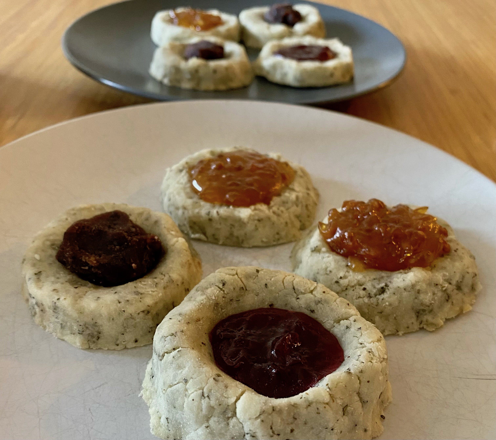
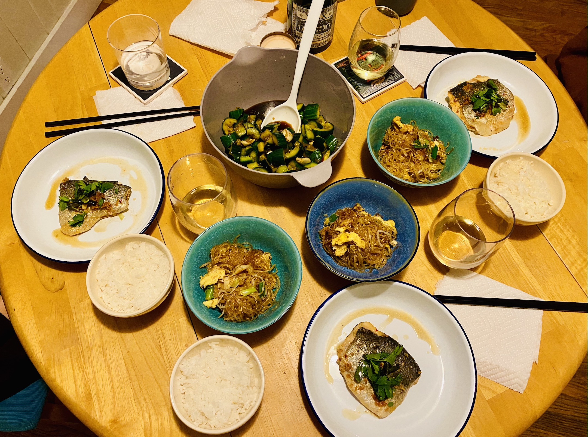
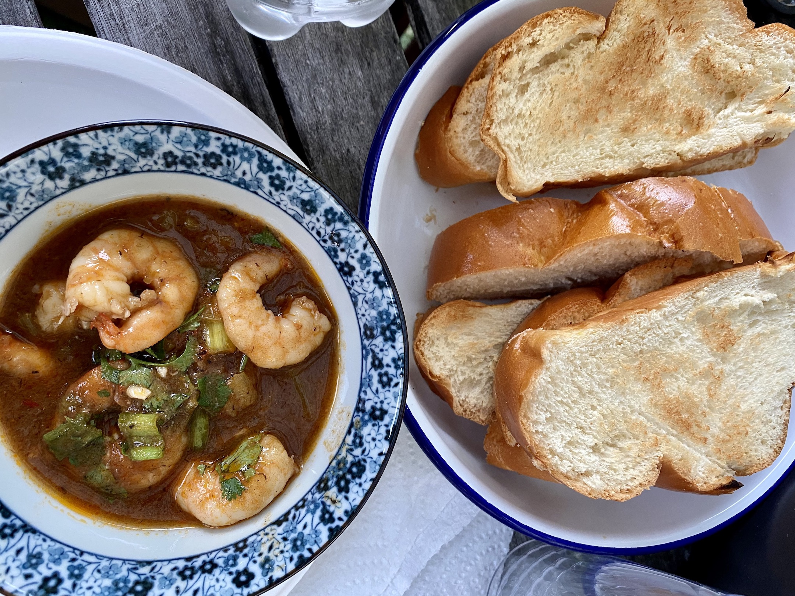

Welcome to my food jotter. Inspired by [home](https://www.visitsingapore.com/dining-drinks-singapore/local-dishes/), [New York Times Cooking](https://cooking.nytimes.com/), and [S. Nosrat](https://www.saltfatacidheat.com/). 

## Baking

 

Lactose-free kormos/doukissa (09/2023)

 

Gluten-free sugar cookies with lingonberry and cloudberry toppings (05/2022)

 

Burfi with slight improvisation (addition of chocolate chunks), based on a recipe by Priya Krishna (03/2022)

 

New York-style bagels, based on a recipe by Claire Saffitz (01/2021)

## Cooking

 

Better reimagining of a Singaporean entrée. Chili crab based on a recipe presented by VisitSingapore  (11/2022)

 
Three-course meal for Chinese New Year (02/2021)

 

Reimagining a Singaporean entrée. Chili crab sauce dip with toasted challah (07/2020)

[back](./)